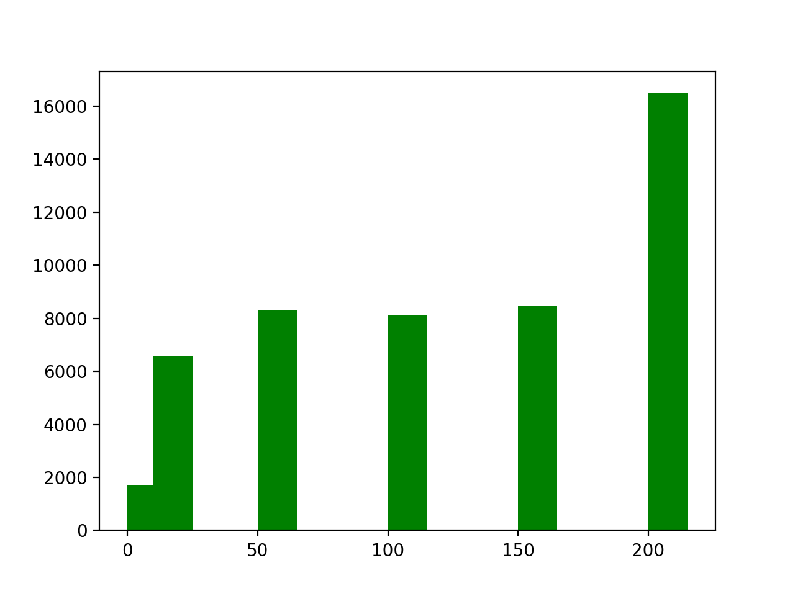
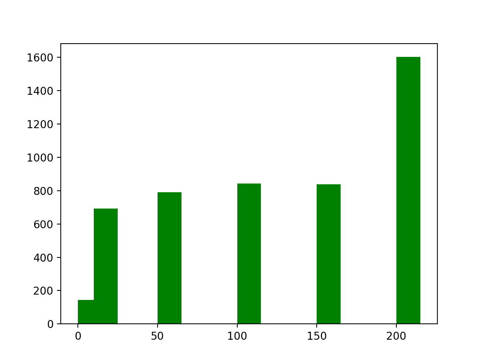

#### Question 3.Answer

A backend processing time increase by an order of magnitude with a increase of number of peers and peer pool size.One of the limitation of the  implementations is that the functions need to treat value by value to sort them in bins. The size of data needs to be treated (backend_database) is list of list. The time complexity of the algorithmes is O($n^2$). In case that real peer network the procces of data treating is inefficient and time consuming

#### Question 4.Answer
The goal of changing to `send_data_to_backend` and `process_backend_data` that can deal with millions of peers
still provide a good representation of the _distribution_ of the connection duration.
The distribution depends on mean and standart deviation, as per law of big numbers we can take a random sample of data but it will not change the distrubution. On the pictures below we can the the distribution for 100% sample and 10% sample - the distribution is the same

Picture 1. 100% sample

Picture 1. 10% sample
